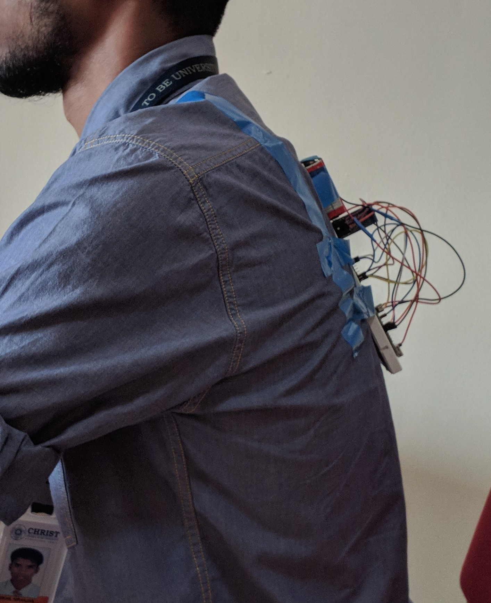
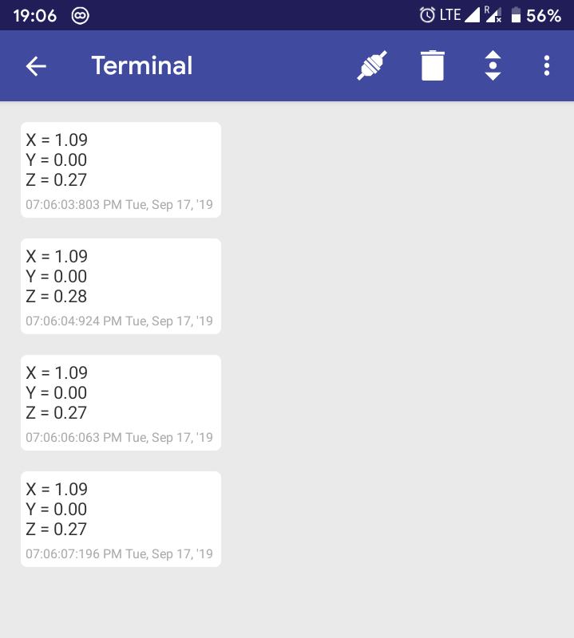
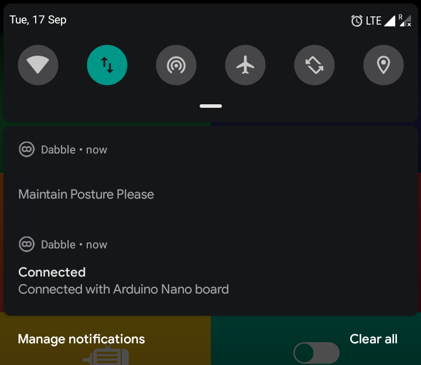

# Posture-Senseii
An ARDUINO based and bluetooth enabled IOT project.

# What is it?

This is the final project for the IOT course at Christ University Faculty of Engineering for BTech in Computer Science.
It was carried out by Basil George Poulose, Nikhil Niranjan and Karthik Krishna.

Posture Senseii is a IOT health tool that detects and monitors a person's posture.

Using this data, it determines whether a person is maintaining a proper posture for medical health maintainability.

If, at any point, the posture is detected to be wrong then the device alerts the user in the following ways : 
+ Visual alert in the form of red LED
+ Audio alert in the form of a beep by the buzzer.
+ Notification alerts on the phone.

Additionally the user can, at any time, access the Dabble application on his/her phone and view real-time values are acquired by the monitor.

# Health risks of bad posture
    (as found on https://www.braceability.com/blogs/info/bad-posture)
    
   + Low energy levels 
   + Chronic neck and back pain
   + Chronic neck and back pain
   + Heart problems
   + Migraines and tension headaches
   + Lack of confidence
   + Digestion issues
    
# How does posture go wrong?
Poor posture or “postural dysfunction” is defined as when our spine is being held in an unnatural position. The result of these unnatural positions are extra stress on our joints, muscles, and vertebrae. Most often, poor posture is something that we naturally do without even noticing. Anyone can suffer from poor posture and if you begin poor posture at a young age, is it likely you will carry it throughout your life. People are becoming more and more susceptible to posture issues because of the use of technology, forcing us to hold ourselves in unique positions to view a small screen. Unless you are actively working towards good posture, you are most likely making some type of posture mistake without even realizing it.

# The Project

+ Components needed

        ● Breadboard 
        ● Jumper wires 
        ● HC-05 Bluetooth module 
        ● Arduino Nano 
        ● ADXL345 3-Axis Accelerometer 
        ● A buzzer 
        ● An LED
        
+ For communicating with phone we used an app called Dabble

        ● https://thestempedia.com/product/dabble/
        ● https://github.com/STEMpedia/Dabble

+ The WIRE library for arduino is required for the ADXL345 to interface with the ARDUINO NANO

        ● https://www.arduino.cc/en/Reference/Wire

+ Screenshots

        01. Circuit Connections - the connections.xls file contains all the connections that need to be made
                
     
        
        02. Actual Model
        
     
     

        03. Mounted shots
        
     
     
       
        04. Mobile Data-View and Notifications
        
     
     
     

+ References :

        ● https://thestempedia.com/product/dabble/
        ● https://github.com/STEMpedia/Dabble
        ● Adafruit ADXL345 documentation
        ● YouTube videos
        ● Wikipedia page for RSI https://en.wikipedia.org/wiki/Repetitive_strain_injury
